# ultrasonic sensor 

ok so the sensor name is *HC-SR04* its a sensor that sends out ultrasonic waves that **bounce off** an object and return back to you

it has a min range of 2cm and max range of 400cm

## how to use it

### 1. it has 4 pins 

```
vcc  <-- normal 5v dc power input 
trig <-- input to start giving out puleses
echo <-- output to tell us if it recived an object at a distance
gnd  <-- normal ground must be connected first to not mess up the sensor
```

### 2. what to do

**1. send on the **trig** pin a 10uS high signal**

**2. The module internally sends out a burst of **8** pulses of **40kHz****

**3. The sound travels out, hits an object, and **bounces** back.**

**4. As soon as the burst is sent, the module raises its **Echo pin HIGH**, and keeps it **HIGH** until **it hears the echo return**.**

**5. So the **width** of that HIGH pulse on Echo = the round-trip **travel time** of the sound wave.**

**6. You calculate distance from that **time** using the speed of sound.**

use this equation 
```
distance_cm = (echo_pulse_time_in_microseconds * 0.0343) / 2 
```
the 0.0343 is the speed of sound in cm/uS
and you devide by 2 cause its a round trip come and go

### 3. what timer to use ?

well we are gonna use **TIMER1** why ?


cause its 16 bit and has an input capture unit
its a unit that allows us to take an input to the atmega32 and give it a **timestamp** so we can use it for later

### 4. how to set it up ?

1. **we set the timer to **normal** mode then we configure pin **PD6** the **ICP1** as input**
2. **send the **10us** to the trig pin (use prescaler 8mhz for ezier calcuations)**
3. **make the **ICES1** (Input Capture Edge Select) to rising edge and wait for the input capture**
4. **you can do it 2 ways either using the ISR or using polling of the ICF1 flag any way when a capture occurs then set the edge select to falling**

   **after you recorded the old **rising edge time** and when the capture comes again in the **falling edge time**** 
5. **the diffrence between the 2 captures is **echo pulse width** but in timer ticks so convert them back to microsecound and convert them to centimeter**

```mermaid
graph LR
    A[Start measurement] --> B["Send 10us HIGH on Trig
    DDRx / PORTx"]
    B --> C["Module sends 8 pulses at 40kHz
    handled internally by sensor"]
    C --> D["Echo pin PD6/ICP1 goes HIGH
    Timer1 captures rising edge"]
    D --> E["Sound travels, hits object, bounces back
    Echo stays HIGH"]
    E --> F["Echo pin goes LOW
    Timer1 captures falling edge"]
    F --> G["pulse_width = falling_time - rising_time
    result in timer ticks"]
    G --> H["Convert ticks to microseconds
    1 tick = 1us at 8MHz / prescaler 8"]
    H --> I["distance_cm = (time_us * 0.0343) / 2
    divide by 2 for round trip"]
    I --> J[Distance ready]
```


